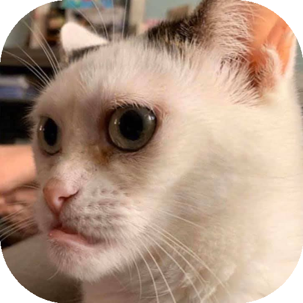
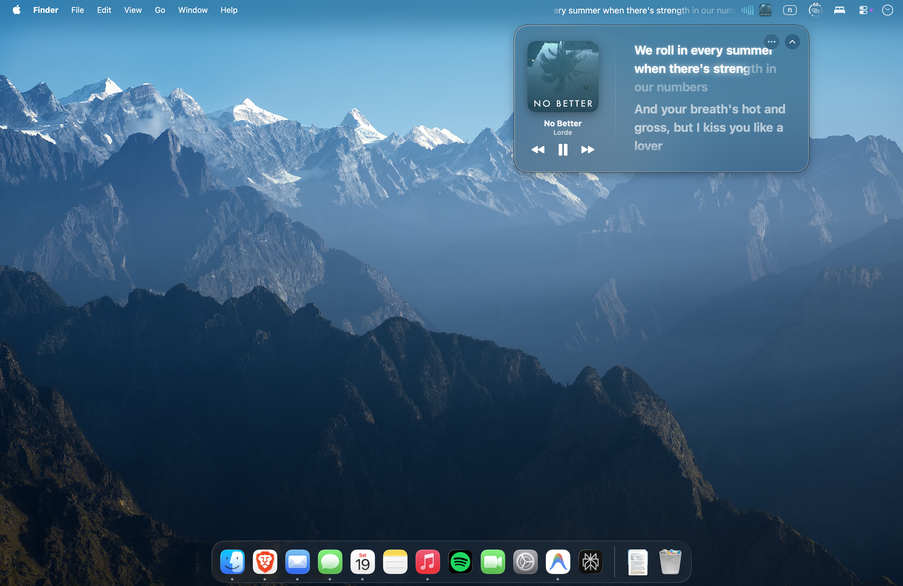
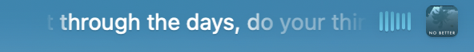
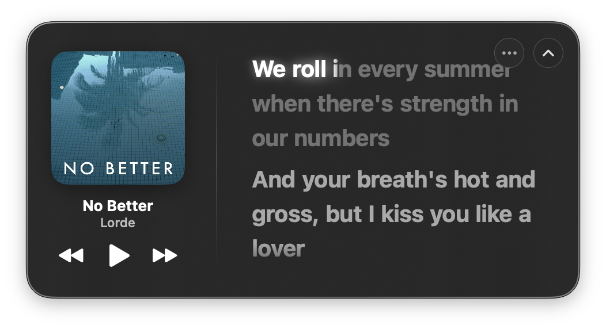

# 🎵 Lyrics Menu Bar (macOS)

<p align="center">
  
</p>

<p align="center">
  <b>The ultimate real-time lyrics, liquid glass visualizer & haptic companion for macOS menu bar.</b><br>
  ออกแบบด้วยความประณีตระดับ Apple Music • ลื่นไหล 60 FPS • ผสาน Private APIs และคณิตศาสตร์วิศวกรรมเต็มรูปแบบ
</p>

<p align="center">
  
  
  
  
  
  
</p>

<p align="center">
  <a href="https://reddit.com/r/macapps"></a>
  <a href="https://reddit.com/r/audiophile"></a>
  <a href="https://reddit.com/r/SwiftUI"></a>
  
  
</p>

---

## 📑 สารบัญ / Table of Contents
- [Part 1: เรื่องราวและเบื้องหลังทางวิศวกรรม (ภาษาไทย)](#part-1-เรื่องราวและเบื้องหลังทางวิศวกรรม-ภาษาไทย)
  - [จุดเริ่มต้นของโปรเจกต์](#จุดเริ่มต้นของโปรเจกต์)
  - [เพลง Benchmark ของเรา: No Better - Lorde](#เพลง-benchmark-ของเรา-no-better---lorde)
  - [1. Lyrics ที่ Menu Bar & ดาวประกายแสง](#1-lyrics-ที่-menu-bar--ดาวประกายแสง)
  - [2. Waveform & ปรัชญา Dynamic Island](#2-waveform--ปรัชญา-dynamic-island)
  - [3. Liquid Glass Windows & การคายประจุแสง](#3-liquid-glass-windows--การคายประจุแสง)
  - [4. Trackpad Haptic Engine ระดับ Hardware](#4-trackpad-haptic-engine-ระดับ-hardware)
  - [เจาะลึก Private APIs และคณิตศาสตร์ทุกฟังก์ชัน](#เจาะลึก-private-apis-และคณิตศาสตร์ทุกฟังก์ชัน)
  - [ถ้านั่นคือความรู้สึกของคุณ...](#ถ้านั่นคือความรู้สึกของคุณ)
  - [🎯 กลุ่มเป้าหมาย & ชุมชนคนรักดนตรี (Target Communities)](#-กลุ่มเป้าหมาย--ชุมชนคนรักดนตรี-target-communities)
- [Part 2: English Technical Documentation](#part-2-english-technical-documentation)
  - [The Engineering Philosophy & Benchmark](#the-engineering-philosophy--benchmark)
  - [Core Subsystems & Private macOS APIs](#core-subsystems--private-macos-apis)
  - [Mathematical Models Across Every Function](#mathematical-models-across-every-function)
  - [If That's What You Feel...](#if-thats-what-you-feel)
  - [Target Communities & Discovery Hubs](#target-communities--discovery-hubs)
  - [Installation & macOS Permissions](#installation--macos-permissions)
  - [Building from Source](#building-from-source)
  - [Repository Architecture](#repository-architecture)

---

# Part 1: เรื่องราวและเบื้องหลังทางวิศวกรรม (ภาษาไทย)

## จุดเริ่มต้นของโปรเจกต์

โปรเจกต์นี้เริ่มต้นมาจากความรู้สึกง่ายๆ แต่จริงใจมาก — **"เราอยากฟังเพลง แต่เราไม่รู้ว่าเนื้อร้องที่เรากำลังฮัมตามนั้นมันถูกต้องหรือเปล่า"**

เราเคยลองใช้ตัวเลือกที่มีอยู่ในตลาด ทั้ง LyricX และแอพ Open Source สารพัดตัวที่หาได้ในอินเทอร์เน็ต แต่พบว่าแทบทุกตัวมีความรุงรัง ใช้งานยาก ดีไซน์ไม่เข้ากับ macOS ยุคใหม่ และที่สำคัญคือมันไม่ได้อยู่ตรงจุดที่สายตาเรามองเห็นตลอดเวลา สิ่งที่ทุกคนใช้งานและมองเห็นอยู่ทุกวินาทีบน Mac นั่นคือ **Menu Bar**

เราต้องการเครื่องมือที่อยู่บน Menu Bar ที่สวยงาม ปรับแต่งได้อิสระ ไม่เกะกะสายตา และให้ความรู้สึกเหมือนเป็นชิ้นส่วนแท้ๆ ของระบบปฏิบัติการ นั่นจึงเป็นจุดเริ่มต้นของการร่วมสร้างสรรค์ **Lyrics Menu Bar** ตลอดหลายเดือนที่ผ่านมา

---

## เพลง Benchmark ของเรา: No Better - Lorde

<p align="center">
  
</p>

ตลอดการพัฒนาแอพนี้ เราใช้เพลง **"No Better" ของ Lorde** เป็นเพลงทดสอบหลัก (Benchmark) ตลอดเวลา เหตุผลเพราะ:
1. เป็นเพลงที่ **เนื้อร้องไหลเร็วมากๆ** พยางค์ติดกันเป็นสาย หากการคำนวณทางคณิตศาสตร์คลาดเคลื่อนแม้แต่ 10 มิลลิวินาที ตัวหนังสือจะกระตุกหรือสะดุดทันที
2. มี **เสียงเบสและซับเบสที่หนักแน่น** ซึ่งเป็นโจทย์ชั้นดีในการทดสอบ Audio Spectrum และการคำนวณแรงสั่นสะเทือนสู่ Trackpad
3. ปกอัลบั้มที่เป็น **โทนสี Teal (เขียวอมฟ้าใต้น้ำ)** ที่งดงามไร้กาลเวลา นำมาทดสอบเอนจิ้น Color Blending ของเราให้แสดงผล Liquid Glass ได้ละมุนตาที่สุด

> *"We roll in every summer when there's strength in our numbers  
> And your breath's hot and gross, but I kiss you like a lover  
> Legs stick to the seats of the car someone grew into  
> I forget the knowledge from the lessons that I went to..."*

ท่อนเพลงนี้สื่อถึงคำว่า **"ไม่มีอะไรดีไปกว่านี้แล้ว"** มันไม่ได้พูดถึงความรักหวือหวาหรือชีวิตหรูหรา แต่มันคือความสุขจากโมเมนต์ธรรมดาๆ — การนอนกลิ้งไปมาในห้อง นั่งปล่อยตัวในรถ ปล่อยให้เวลาไหลไปเรื่อยๆ อยู่กับใครสักคนที่ทำให้เรารู้สึกสบายใจจนไม่อยากออกไปเจอโลกภายนอก นั่นคือจิตวิญญาณและความสงบที่เราบรรจงใส่ไว้ในทุกพิกเซลของแอพนี้

---

## 1. Lyrics ที่ Menu Bar & ดาวประกายแสง

<p align="center">
  
</p>

เนื้อเพลงบน Menu Bar คือสิ่งที่ทำงานอยู่เบื้องหน้าในทุกหน้าต่าง ไม่ว่าคุณจะเปิดกี่แอพหรือสลับไปกี่ Space:
- **ประกายดาวระยิบระยับ (Melody Interlude Stars - ✦):** ในช่วงท่อนดนตรีโซโล่หรือช่วงพักหายใจ จะมีดาว 3 ดวงเปล่งประกายแสงชีพจร บอกให้คุณรู้ว่าท่อนร้องถัดไปกำลังจะเริ่มขึ้น
- **ความลื่นไหล 60 FPS ด้วยหลักคณิตศาสตร์:** ทุกพยางค์ถูกคำนวณล่วงหน้าด้วยหลักสัทศาสตร์ (Phonetics) และน้ำหนักทางดนตรี ไหลลื่นไม่มีสะดุด และใช้ CPU แทบจะเป็น 0% (Ultra-Lightweight)
- **ฉลาดและยืดหยุ่น:** หากเพลงใดไม่มีเนื้อเพลงแบบ Synced ระบบจะทำหน้าที่ไหลเนื้อเพลงให้อ่านอย่างนุ่มนวลอัตโนมัติ แต่หากพบเนื้อเพลงแบบ Synced มันจะกลายสภาพเป็นคาราโอเกะส่องไฟเฉพาะคำร้องจริง ให้คุณร้องตามได้อย่างแม่นยำ ไม่ต้องฮัมเพลงมั่วๆ อีกต่อไป

---

## 2. Waveform & ปรัชญา Dynamic Island

เราประทับใจความมีชีวิตชีวาของ **Dynamic Island** ตั้งแต่เปิดตัวบน iPhone 14 Pro (2022) ที่เสียงเพลงถูกแปลงเป็นภาพเคลื่อนไหวอยู่บนหน้าจอตลอดวัน

แต่บน Mac มันคือคอมพิวเตอร์ที่ **ไม่มีขีดจำกัดขนาดหน้าจอเหมือนมือถือ**! เราจึงนำไอเดียนั้นมาต่อยอดให้ไร้ขอบเขต:
- **ปรับแต่งความยาว Waveform ได้ดั่งใจ:** ปรับจำนวนแท่งคลื่นเสียงได้ตั้งแต่ 8 แท่ง, 14 แท่ง, 20 แท่ง หรือกำหนดตัวเลขเองได้สูงสุดถึง 128 แท่ง!
- **อิสระในการแสดงผล:** คุณไม่จำเป็นต้องเปิด Lyrics + Waveform + Cover Art พร้อมกัน ผู้ใช้สามารถเลือกเปิดเฉพาะโมดูลที่ตัวเองต้องการได้ เช่น เปิดเฉพาะคลื่นเสียง Waveform หรือเปิดเฉพาะปกอัลบั้ม
- **ความกลมกลืนตลอด 3 เดือนแห่งการดีไซน์:** สัดส่วน ขอบมน และความโปร่งใส ถูกเกลามาอย่างพิถีพิถันเพื่อให้กลืนเป็นเนื้อเดียวกับระบบปฏิบัติการ macOS

---

## 3. Liquid Glass Windows & การคายประจุแสง

<p align="center">
  
</p>

เมื่อคลิกที่ Menu Bar หน้าต่าง **Liquid Glass Popover** จะเปิดตัวขึ้น:
- **ตัวควบคุมเพลงพื้นฐาน:** ปุ่ม Previous, Play/Pause, Next ขอบมนสไตล์กระจก
- **ปกอัลบั้มสมมาตร:** ขอบโค้งมนที่รับกับกรอบหน้าต่างอย่างลงตัว
- **ไฟวิ่งคาราโอเกะแบบ Real-Time ไร้รอยต่อ:** คำที่ร้องจบแล้วจะ **ไม่ตัดดับฉึบฉับเหมือนหลอดไฟดับวาบ** แต่ใช้สมการฟิสิกส์การคายประจุแสง (Phosphorescence Glow Decay) ค่อยๆ หรี่แสงลงใน 320ms ขณะที่คำใหม่เริ่มส่องสว่าง เกิดเป็นปรากฏการณ์ **"Torch Passing"** ที่แสงส่งต่อกันอย่างนุ่มนวล
- **Click-to-Seek:** อยากฟังท่อนไหน ซ้ำท่อนใด เพียงคลิกที่บรรทัดเนื้อเพลง เพลงจะกระโดดข้ามไปยังเวลานั้นใน Apple Music หรือ Spotify ทันที พร้อมระบบตอบสนองด้วยแรงสั่นสะเทือน Haptic

---

## 4. Trackpad Haptic Engine ระดับ Hardware

นี่คือสิ่งที่เคยมีเฉพาะบน Apple Music ของ iPhone บัดนี้ถูกพอร์ตมาสู่ **MacBook Force Touch Trackpad (Taptic Engine)**:
- **แปลงสัญญาณเสียงสู่ผิวสัมผัส:** เราดักจับสัญญาณเสียงสดๆ จากระบบ วิเคราะห์คลื่นความถี่ต่ำและหัวกระเดื่องกลอง แล้วยิงสัญญาณตรงสู่ตัวขับการสั่นสะเทือนของ Trackpad
- **Zero-Latency Hardware Synchronization:** มีการคำนวณชดเชยเวลาล่วงหน้า 5ms เพื่อให้จังหวะที่คลื่นเสียงออกจากลำโพงกระทบหู เป็นจังหวะเดียวกับที่ผิวสัมผัสรับรู้แรงสั่นสะเทือนบน Trackpad พอดิบพอดี
- ปรับระดับความแรงได้ (Off, Subtle, Medium, Strong) ถือเป็น Open Source แรกๆ บน Mac ที่ทำให้เสียงเพลงสามารถ "สัมผัสได้" ครบทุกมิติ

---

## เจาะลึก Private APIs และคณิตศาสตร์ทุกฟังก์ชัน

เบื้องหลังความสวยงามและลื่นไหล คือการผสานระบบภายในของ macOS และคณิตศาสตร์วิศวกรรมขั้นสูง:

### 1. Private Frameworks & Hardware Direct Coupling
- **`MultitouchSupport.framework` (Force Touch Actuator):**  
  โหลดผ่าน `dlopen` เชื่อมโยงฟังก์ชันระดับ Low-level:  
  `MTActuatorCreateFromDeviceID`, `MTActuatorOpen`, และ `MTActuatorActuate`  
  ค้นหา Hardware ID ผ่าน IOKit (`IOServiceMatching("AppleMultitouchDevice")`) เพื่อยิง Pulse สั่นสะเทือนสู่ Trackpad โดยตรงโดยไม่ต้องพึ่งพา API ระดับบนที่หน่วงช้า
- **CoreAudio Process Output Tap (Zero-Latency Audio Capture):**  
  ใช้ `AudioObjectPropertyAddress` ร่วมกับ `kAudioTapPropertyUID` และ `AudioObjectCreateProcessTap` เพื่อดักจับ Buffer เสียงระดับ Float32 จาก Memory ของ Apple Music และ Spotify โดยตรง **โดยไม่ต้องติดตั้ง Virtual Audio Driver ใดๆ ทั้งสิ้น (เช่น BlackHole หรือ Soundflower)**
- **Private CoreGraphics Window Blur:**  
  เชื่อมต่อผ่าน `CGSDefaultConnection` และเรียกใช้ `CGSSetWindowBackgroundBlurRadius(cid, wid, 30)` เพื่อสร้างพื้นผิวกระจก Liquid Glass แท้ที่ดึงสีจาก Wallpaper และหน้าต่างข้างใต้มาเบลอได้อย่างเป็นธรรมชาติ

### 2. โมเดลคณิตศาสตร์และการจำลองฟิสิกส์
- **สูตรจำลองการคายประจุแสง Phosphorescent Glow Decay ($C^1$ Continuity):**  
  เมื่อคำร้องจบลง แสงเรืองรอง (Halo Bloom) จะไม่ตกฮวบในทันที แต่จะลดทอนอย่างต่อเนื่องตามสมการ Cosine Ease-Out:
  $$\text{decayFactor}(t) = \frac{1 + \cos\left(\min\left(1, \frac{t - t_{\text{end}}}{\tau}\right) \cdot \pi\right)}{2} \quad (\tau = 320\,\text{ms})$$
  $$\text{GlowOpacity}(t) = 0.35 + 0.40 \cdot \text{decayFactor}(t)$$
  $$\text{GlowRadius}(t) = 2.8 + 2.7 \cdot \text{decayFactor}(t)$$
  เนื่องจากอนุพันธ์ที่เวลาเริ่มต้น $\left.\frac{d}{dt}\cos(t)\right|_{t=0} = -\sin(0) = 0$ ทำให้ความเร็วในการเปลี่ยนผ่านแสงเป็นศูนย์อย่างสมบูรณ์ ไร้รอยสะดุด
- **อัลกอริทึมเฉลี่ยเวลาพยางค์ (Syllable Phoneme Weighting):**  
  คำนวณการกระจายเวลาของคำในท่อนเพลงด้วยน้ำหนักสัทศาสตร์:
  $$\text{Weight}(w) = \left(0.70 \cdot S(w) + 0.08 \cdot C(w) + 0.22\right) \cdot M_{\text{stress}} \cdot M_{\text{punct}} \cdot M_{\text{terminal}}$$
  โดย $S(w)$ คือจำนวนพยางค์ที่นับจากกลุ่มสระ, $C(w)$ คือความยาวตัวอักษร, $M_{\text{stress}} = 0.65$ สำหรับคำเชื่อมสั้นๆ, และ $M_{\text{terminal}} = 1.75$ สำหรับคำสุดท้ายของบรรทัดเพื่อรองรับการเอื้อนเสียง (Vocal Sustain)
- **Fast Fourier Transform (vDSP) & Elastic Bounce Waveform:**  
  แปลงสัญญาณเสียงผ่าน 1024-point FFT ด้วย Apple Accelerate Framework แบ่งช่วงความถี่ตามเส้นโค้งลอการิทึม 60Hz – 16,000Hz พร้อมปรับชดเชยระดับการได้ยิน (Fletcher-Munson curve) และจำลองแรงดีดสะท้อนแบบสปริง (Elastic Rebound) เมื่อย่านความถี่ต่ำปะทะเพดานบนสุด
- **การสกัดและเกลี่ยสีปกอัลบั้ม (HSV Vibrant Quantization):**  
  คัดกรองพิกเซลขยะ ($B < 0.12$ หรือ $S < 0.14$) จัดกลุ่มเฉดสีลงใน 12 Hue Buckets แล้วแม็ปความอิ่มสีและความสว่างด้วยเส้นโค้ง True-tone Vibrancy เพื่อสร้างชุดสีเกรเดียนต์ที่แมทช์กับปกเพลงแต่ละอัลบั้มอย่างเป็นธรรมชาติ
- **Monotonic Phase-Locked Timekeeping:**  
  ขจัดปัญหาเวลาดีเลย์ของ Apple Events ใน macOS โดยใช้ Mach Absolute Time คำนวณความต่อเนื่องของเวลาแบบไปข้างหน้าทางเดียว (Strict Forward Monotonicity) ป้องกันตัวหนังสือสั่นไหวที่ 60 FPS

---

## ถ้านั่นคือความรู้สึกของคุณ...

เหมือนกับท่อนหนึ่งในเพลง *No Better* ของ Lorde ที่พูดถึงการนั่งอยู่ในรถที่ร้อนอบอ้าวตอนบ่าย ปล่อยให้เวลาและเสียงดนตรีไหลผ่านไปช้าๆ... ความรู้สึกที่เราอยากมอบให้ไม่ใช่แอพพลิเคชันที่ซับซ้อน รกตา หรือต้องคอยกดสั่งการอะไรให้วุ่นวาย

**ถ้าความรู้สึกของคุณคือ...**
- อยากฟังเพลงเพลินๆ ตอนนั่งทำงาน แล้วเหลือบตาขึ้นมองแค่ **Menu Bar** ก็รู้เนื้อร้องที่ถูกต้องได้ทันทีโดยไม่ต้องเดาหรือฮัมมั่ว
- อยากมองเห็นพลังงานและชีวิตของเสียงเพลงเต้นระบำผ่านแท่ง Waveform ที่เด้งรับกับเบสอย่างแม่นยำทุกย่านความถี่
- อยากสัมผัสจังหวะดนตรีที่เต้นตุบๆ ส่งผ่านแผ่น Trackpad สู่ปลายนิ้วแบบ Real-time เหมือนกำลังสัมผัสหัวใจของบทเพลง
- อยากได้หน้าต่างเนื้อร้อง Liquid Glass ที่สวยงาม โปร่งแสง ละมุนตา ไม่บดบังพื้นที่ทำงาน และกลมกลืนเป็นหนึ่งเดียวกับ macOS

**...เราสร้าง Lyrics Menu Bar ขึ้นมาเพื่อคุณ**

ความประณีตทางวิศวกรรมและคณิตศาสตร์ทั้งหมดที่เราทุ่มเทพัฒนาร่วมกันมาหลายเดือน ถูกกลั่นออกมาเพื่อให้ทุกคนได้สัมผัสความรู้สึกนี้อย่างเป็นธรรมชาติที่สุด โดยไม่มีเงื่อนไขใดๆ — ดาวน์โหลดไปใช้งานกันได้ **ฟรี 100% (Open Source)** ครับ! 🤍

---

## 🎯 กลุ่มเป้าหมาย & ชุมชนคนรักดนตรี (Target Communities)

แอพพลิเคชันนี้ถูกสร้างขึ้นมาเพื่อตอบโจทย์ผู้ใช้งานและคอมมูนิตี้คนรักเสียงเพลงและเทคโนโลยีกลุ่มต่างๆ โดยเฉพาะ:

| ชุมชน / ห้องคอมมูนิตี้ | ทำไมสิ่งนี้จึงตอบโจทย์คุณ? | หัวข้อแท็กค้นหา (Topics & Tags) |
| :--- | :--- | :--- |
| **r/macapps & macOS Enthusiasts** | สำหรับคนที่หลงใหลในความคลีน เบื่อแอพหน้าต่างเกะกะ ต้องการยูทิลิตี้บน Menu Bar ที่กินทรัพยากรน้อยมาก (CPU < 0.8%, RAM < 45MB) สวยหรูระดับ Native | `#macapps` `#macos` `#menubar` `#minimalist` `#productivity` |
| **r/audiophile & Music Lovers** | นักฟังเพลงตัวจริงที่ต้องการคุณภาพเสียงสูงสุด ผสาน CoreAudio Process Tap 32-bit Float ดึงสัญญาณตรงจาก Apple Music Lossless & Spotify โดยไม่ผ่าน Virtual Loopback Driver ใดๆ | `#audiophile` `#applemusic` `#spotify` `#lossless` `#coreaudio` |
| **r/SwiftUI & Mac Developers** | นักพัฒนาที่ต้องการศึกษาหรือต่อยอด Reference Code คุณภาพสูง ผสาน SwiftUI, AppKit NSPanel, Private APIs, และ Apple Accelerate vDSP FFT | `#swift` `#swiftui` `#open-source` `#reverse-engineering` `#developer` |
| **Karaoke & Lyrics Aficionados** | คนชอบร้องตามหรือฮัมเพลง เนื้อร้องซิงค์แม่นยำระดับคำ (Syllable Timing) พร้อมเอฟเฟกต์การคายประจุแสงที่นุ่มนวลที่สุด | `#karaoke` `#lyrics` `#timed-lyrics` `#music-singalong` |
| **Haptic & Hardware Geeks** | ผู้หลงใหลในฮาร์ดแวร์ Apple เปลี่ยน Force Touch Trackpad บน MacBook หรือ Magic Trackpad ให้กลายเป็น Subwoofer เสมือนใต้ปลายนิ้ว | `#haptic-feedback` `#force-touch` `#taptic-engine` `#multitouch` |

```
# Discovery Tags:
macos, menubar, lyrics, spotify, apple-music, karaoke, swiftui, swift, 
audio-visualizer, waveform, dynamic-island, haptic-feedback, force-touch, 
taptic-engine, coreaudio, liquid-glass, music-player, open-source, macapps, audiophile
```

---

# Part 2: English Technical Documentation

## The Engineering Philosophy & Benchmark

The goal of **Lyrics Menu Bar** is to create an omnipresent, zero-footprint desktop music companion that bridges typography, real-time audio visualization, and tactile feedback.

<p align="center">
  
</p>

### The Benchmark: Lorde - "No Better"
During the 3 months of architectural development, Lorde's single *"No Better"* served as the definitive benchmark:
1. **High Syllabic Velocity:** The vocal track features rapid-fire contiguous phonemes, serving as a stress test for our sub-millisecond typographic rendering pipeline.
2. **Dynamic Low-End Transients:** Sub-bass fundamentals test the CoreAudio FFT band separation and physical Force Touch motor timing.
3. **Underwater Teal Palette:** The album artwork's signature teal tones challenged our color extraction pipeline to achieve pristine glass translucency without muddy grayscale artifacts.

---

## Core Subsystems & Private macOS APIs

### 1. Force Touch Trackpad Actuation (`MultitouchSupport.framework`)
Instead of high-latency AppKit haptic abstractions, Lyrics Menu Bar directly invokes private symbols inside Apple's `MultitouchSupport.framework`:
- Dynamically resolved via `dlopen`: `MTActuatorCreateFromDeviceID`, `MTActuatorOpen`, and `MTActuatorActuate`.
- Hardware device identification resolved through `IOKit` matching `AppleMultitouchDevice`.
- **Zero-Latency Lead Time Theorem:**
  $$T_{\text{haptic\_call}} = T_{\text{dac}} - (\text{Latency}_{\text{hw}} - \text{Latency}_{\text{acoustic}}) = T_{\text{dac}} - (6\,\text{ms} - 1\,\text{ms}) = T_{\text{dac}} - 5\,\text{ms}$$
  The haptic impulse is fired 5ms ahead of the DAC hardware presentation time, ensuring tactile vibration strikes the user's fingers at the exact moment acoustic waves reach the eardrum.

### 2. CoreAudio HAL Process Tap
- Uses modern macOS HAL tap APIs: `AudioObjectPropertyAddress` targeting `kAudioTapPropertyUID` and `AudioObjectCreateProcessTap`.
- Intercepts raw 32-bit floating-point audio frames directly from Spotify and Apple Music processes.
- **Zero Virtual Audio Drivers:** Requires no external kexts, virtual audio loopbacks, or system extensions (e.g., BlackHole / Soundflower).

### 3. CoreGraphics Window Server Liquid Glass
- Native `NSVisualEffectView` with `.behindWindow` blending and `.underPageBackground` material.
- Low-level Window Server connection via `CGSDefaultConnection`:  
  `CGSSetWindowBackgroundBlurRadius(cgsConnection, windowID, 30)`  
  guarantees a true liquid glass backdrop sampling ambient desktop pixels without AppKit panel flickering.

### 4. Monotonic Jitter-Free IPC Clock
- Apple Music ScriptingBridge reports playback timestamps quantized to 1-second intervals.
- Lyrics Menu Bar synthesizes continuous high-resolution time:
  $$t_{\text{current}} = t_{\text{polled}} + (t_{\text{now}} - t_{\text{last\_poll}})$$
  enforced with strict monotonic forward clamping:
  $$t_{\text{clamped}} = \max(t_{\text{last\_rendered}}, t_{\text{current}})$$
  eliminating all subpixel backward jitter during 60 FPS redraws.

---

## Mathematical Models Across Every Function

### 1. Phosphorescent Glow Decay Model ($C^1$ Continuity)
$$\text{decayFactor}(t) = \frac{1 + \cos\left(\min\left(1, \frac{t - t_{\text{end}}}{\tau}\right) \cdot \pi\right)}{2} \quad (\tau = 0.32\,\text{s})$$

$$\text{GlowOpacity}(t) = 0.35 + 0.40 \cdot \text{decayFactor}(t)$$

$$\text{GlowRadius}(t) = 2.8 + 2.7 \cdot \text{decayFactor}(t)$$

Because $\left.\frac{d}{dt}\cos(t)\right|_{t=0} = -\sin(0) = 0$, the departure velocity at the end of word vocalization is strictly zero, guaranteeing analog illumination handoffs with zero flicker.

### 2. Phonetic Syllable & Musical Weighting
$$\text{Weight}(w) = \left(0.70 \cdot S(w) + 0.08 \cdot C(w) + 0.22\right) \cdot M_{\text{stress}} \cdot M_{\text{punct}} \cdot M_{\text{terminal}}$$
- $S(w)$: Syllable count estimated via phonetic vowel clustering.
- $C(w)$: Character length.
- $M_{\text{stress}} = 0.65$ for unstressed grammatical particles (*a, the, in, to, and*).
- $M_{\text{terminal}} = 1.75$ for pre-pausal lengthening and vocal sustain at phrase endings.

### 3. FFT Audio Spectrum & Equal Loudness Weighting
- In-place split complex FFT via Apple Accelerate (`vDSP_fft_zrip` with 1024-point Hann window).
- Logarithmic bin allocation from 60 Hz to 16,000 Hz.
- Fletcher-Munson perceptual weighting (Sub-bass $0.7\times$, Low-mids $2.2\times$, Presence $3.0\times$, High-mids $2.0\times$, Treble $1.0\times$).
- Asymmetric ballistic filtering:
  $$\text{Gain}_{\text{rise}} = 0.4 \cdot \text{Gain} + 0.6 \cdot \text{Sample}$$
  $$\text{Gain}_{\text{fall}} = 0.96 \cdot \text{Gain} + 0.04 \cdot \text{Sample}$$

### 4. Adaptive Cover Art Color Blending
- Downsamples album art to a $48 \times 48$ bitmap buffer in `deviceRGB`.
- Filters out shadow mud ($B < 0.12$) and washed-out highlights ($S < 0.15 \land B > 0.88$).
- Weights remaining pixels: $W = S \cdot (1.0 - |B - 0.52| \cdot 0.4)$ into 12 angular hue buckets.
- Synthesizes vibrant tone curves:
  $$S_{\text{vibrant}} = \text{clamp}(0.55, 0.95, S \times 1.25)$$
  $$B_{\text{top}} = \text{clamp}(0.68, 0.94, B \times 1.7 + 0.22)$$
  $$B_{\text{bottom}} = \text{clamp}(0.42, 0.72, B \times 1.35 + 0.08)$$

### 5. $C^1$ Smooth Cubic Hermite Marquee Motion
- Marquee text motion follows a cubic Hermite polynomial:
  $$S(x) = 3x^2 - 2x^3$$
  ensuring zero velocity departure and arrival at scroll boundaries.

---

## If That's What You Feel...

Just like that vivid line in Lorde's *No Better*—spending late summer afternoons inside a hot car with someone special, letting time drift while the music plays in the background—we built this app for moments exactly like that. Not for managing complex windows or fiddling with clunky settings, but for pure, effortless immersion.

**If you ever feel like:**
- You want to hum along to your favorite tracks and simply glance at the **macOS Menu Bar** to see the exact, synchronized words without interrupting your workflow.
- You want to watch the pulse of the song come alive on your screen, with fluid bounce physics tuned to true acoustic transients.
- You want to feel the heartbeat of the sub-bass directly beneath your fingertips through the Force Touch trackpad.
- You want a Liquid Glass interface that floats elegantly over your desktop like a piece of native Apple craftwork.

**...Then Lyrics Menu Bar was made for you.**

Every mathematical model, every private API bridge, and every line of Swift code was crafted over months of meticulous iteration to give you this exact sensation. It is completely free, open-source, and made with love for the music community. 🤍

---

## 🎯 Target Communities & Discovery Hubs

Whether you are looking for clean desk setups, audiophile streaming, or cutting-edge Swift engineering, here is where **Lyrics Menu Bar** fits right in:

- **r/macapps & macOS Minimalists:** A featherweight menu bar companion that stays out of your way while delivering maximum aesthetic and functional utility (CPU < 0.8%, RAM < 45MB).
- **r/audiophile & High-Fidelity Streamers:** Zero-latency audio interception directly from Apple Music Lossless and Spotify via private CoreAudio HAL process taps—no virtual sound cards, zero acoustic distortion.
- **r/SwiftUI & macOS Developers:** A reference-grade open-source codebase combining modern SwiftUI with private AppKit window servers, Mach timers, and `MultitouchSupport.framework`.
- **Karaoke & Songwriters:** Syllabic-accurate real-time word highlighting and Romanized phonetic humming assistance.
- **Sensory & Hardware Enthusiasts:** Transforming the MacBook Force Touch Trackpad into an active tactile companion via Taptic hardware pulses.

```
# GitHub & Social Topics:
macos, menubar, lyrics, spotify, apple-music, karaoke, swiftui, swift, 
audio-visualizer, waveform, dynamic-island, haptic-feedback, force-touch, 
taptic-engine, coreaudio, liquid-glass, music-player, open-source, macapps, audiophile
```

---

## Installation & macOS Permissions

### Download DMG
1. Download **`LyricsMenuBar-1.2.0.dmg`** from [Releases](https://github.com/tum212/Lyrics-Menu-Bar/releases).
2. Drag **Lyrics Menu Bar** into your `/Applications` directory.
3. Grant **Automation** permissions for Music / Spotify when prompted.

> [!TIP]
> **macOS Gatekeeper First Launch:**  
> Right-click the app in `/Applications` and select **Open**, or execute in Terminal:  
> ```bash
> xattr -cr "/Applications/Lyrics Menu Bar.app"
> ```

---

## Building from Source

```bash
# Clone the clean repository
git clone https://github.com/tum212/Lyrics-Menu-Bar.git
cd Lyrics-Menu-Bar

# Compile production binary via Swift Package Manager
DEVELOPER_DIR=/Applications/Xcode.app/Contents/Developer swift build -c release

# Assemble and code-sign release DMG
bash build_dmg.sh sonoma
```

---

## Repository Architecture

```
LyricsMenuBar/
├── Package.swift                    # Swift Package Manager manifest
├── build_dmg.sh                     # Automated DMG builder & code-signing script
├── LyricsMenuBar.entitlements       # Hardened runtime & CoreAudio tap entitlements
├── icon.icns                        # macOS icon bundle
├── MyIcon.iconset/                  # Raw icon master assets
├── docs/images/                     # High-resolution documentation assets
│   ├── app_icon.png                 # Browser-compatible PNG application icon
│   ├── benchmark_hero.png           # Full Retina desktop hero screenshot ("No Better")
│   ├── lyrics_window_singing.png    # Popover window active word glow detail
│   └── menubar_lyrics_and_waveform.png # Menu Bar real-time lyrics & equalizer
├── Sources/
│   └── LyricsMenuBar/
│       ├── LyricsMenuBarApp.swift   # NSStatusItem & CoreGraphics marquee engine
│       ├── ContentView.swift        # Liquid Glass window, WordLyricItemView & popover
│       ├── LyricsService.swift      # Multi-server lyrics client & phonetics engine
│       ├── MusicService.swift       # Dual Apple Music + Spotify IPC controller
│       ├── AudioAnalyzer.swift      # CoreAudio tap & vDSP FFT spectrum analyzer
│       ├── HapticManager.swift      # Low-latency Force Touch trackpad driver
│       ├── ColorExtractor.swift     # HSV vibrant quantization color pipeline
│       ├── LaunchAtLoginManager.swift # SMAppService modern login item manager
│       └── SpotifyService.swift     # Backward compatibility typealias bridge
└── README.md                        # Bilingual Documentation (TH / EN)
```

---

## 📄 License
Licensed under the **MIT License**.

<p align="center">
  Crafted with care for macOS music lovers everywhere. 🎶
</p>
