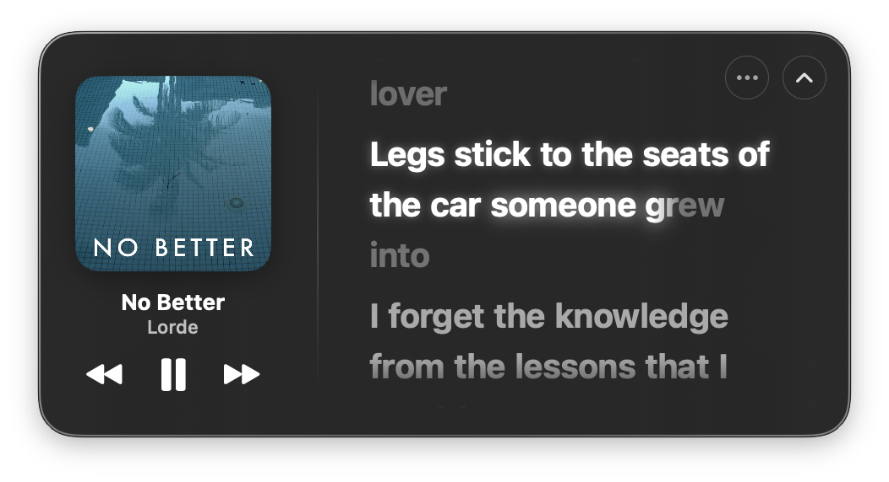

# 🎵 Lyrics Menu Bar (macOS)

<p align="center">
  
</p>

<p align="center">
  <b>The ultimate real-time lyrics, liquid glass visualizer & haptic companion for macOS menu bar.</b><br>
  ออกแบบด้วยความประณีตระดับ Apple Music • ลื่นไหล 60 FPS • ประหยัดพลังงานระดับ Ultra-Lightweight
</p>

<p align="center">
  
  
  
  
  
</p>

---

## 📑 สารบัญ / Table of Contents
- [Part 1: เรื่องราวและฟีเจอร์ (ภาษาไทย)](#part-1-เรื่องราวและฟีเจอร์-ภาษาไทย)
  - [จุดเริ่มต้นของโปรเจกต์](#จุดเริ่มต้นของโปรเจกต์)
  - [เพลง Benchmark ของเรา: No Better - Lorde](#เพลง-benchmark-ของเรา-no-better---lorde)
  - [1. Lyrics ที่ Menu Bar](#1-lyrics-ที่-menu-bar)
  - [2. Waveform & Dynamic Island](#2-waveform--dynamic-island)
  - [3. Liquid Glass Windows](#3-liquid-glass-windows)
  - [4. Trackpad Haptic Feedback](#4-trackpad-haptic-feedback)
  - [ก้าวต่อไปของ Lyrics Menu Bar](#ก้าวต่อไปของ-lyrics-menu-bar)
- [Part 2: English Version (Overview, Philosophy & Architecture)](#part-2-english-version-overview-philosophy--architecture)
  - [The Story Behind Lyrics Menu Bar](#the-story-behind-lyrics-menu-bar)
  - [The Benchmark: "No Better" by Lorde](#the-benchmark-no-better-by-lorde)
  - [Core Features & Innovation](#core-features--innovation)
  - [The Mathematics & Physics](#the-mathematics--physics)
  - [Installation & Setup](#installation--setup)
  - [Building from Source](#building-from-source)
  - [Project Architecture](#project-architecture)

---

# Part 1: เรื่องราวและฟีเจอร์ (ภาษาไทย)

## จุดเริ่มต้นของโปรเจกต์

โปรเจกต์นี้เริ่มต้นมาจากความรู้สึกง่ายๆ แต่จริงใจมาก — **"เราอยากฟังเพลง แต่เราไม่รู้ว่าเนื้อร้องที่เรากำลังฮัมตามนั้นมันถูกต้องหรือเปล่า"**

เราเคยลองใช้ตัวเลือกที่มีอยู่ในตลาด ทั้ง LyricX และแอพ Open Source สารพัดตัวที่หาได้ในอินเทอร์เน็ต แต่พบว่าแทบทุกตัวมีความรุงรัง ใช้งานยาก หน้าตาไม่เข้ากับ macOS ยุคใหม่ และที่สำคัญคือมันไม่ได้อยู่ตรงจุดที่สายตาเรามองเห็นตลอดเวลา สิ่งที่ทุกคนใช้งานและมองเห็นอยู่ทุกวินาทีบน Mac นั่นคือ **Menu Bar** 

เราต้องการเครื่องมือที่อยู่บน Menu Bar ที่สวยงาม กลืนไปกับระบบ และต้องปรับแต่งได้ดั่งใจ นั่นจึงเป็นจุดกำเนิดของ **Lyrics Menu Bar**

---

## เพลง Benchmark ของเรา: No Better - Lorde

<p align="center">
  
</p>

ตลอดการพัฒนาแอพนี้ เราใช้เพลง **"No Better" ของ Lorde** เป็นเพลงทดสอบหลัก (Benchmark) ตลอดเวลา เหตุผลเพราะ:
1. เป็นเพลงที่ **เนื้อร้องไหลเร็วมาก** จังหวะคำร้องติดกันเป็นพืด หากระบบคำนวณเวลาผิดแม้แต่มิลลิวินาทีเดียว ตัวหนังสือจะกระตุกทันที
2. มี **เสียงเบสและซับเบสที่หนักแน่น** เหมาะกับการจูนคลื่นเสียง Waveform และแรงสั่น Haptic
3. ปกอัลบั้มที่เป็น **โทนสี Teal (เขียวอมฟ้าใต้น้ำ)** ที่สวยงามมาก เมื่อนำมาผ่านเอนจิ้นเบลอสี Liquid Glass แล้วจะให้มู้ดที่ละมุนสายตาที่สุด

> *"We roll in every summer when there's strength in our numbers  
> And your breath's hot and gross, but I kiss you like a lover  
> Legs stick to the seats of the car someone grew into  
> I forget the knowledge from the lessons that I went to..."*

ท่อนเพลงนี้สื่อถึงคำว่า **"ไม่มีอะไรดีไปกว่านี้แล้ว"** มันไม่ได้พูดถึงความรักหวือหวาหรือชีวิตหรูหรา แต่มันคือความสุขจากโมเมนต์ธรรมดาๆ — การนอนกลิ้งไปมาในห้อง นั่งปล่อยตัวในรถในวันแดดร้อน ปล่อยให้เวลาไหลไปเรื่อยๆ อยู่กับใครสักคนที่ทำให้เรารู้สึกสบายใจจนไม่อยากออกไปเจอโลกภายนอก นั่นคือจิตวิญญาณและความรู้สึกสงบ สบายตา ที่เราถ่ายทอดลงมาสู่ UI และ Animation ของแอพนี้

<p align="center">
  
</p>

---

## 1. Lyrics ที่ Menu Bar

<p align="center">
  
</p>

เนื้อเพลงบน Menu Bar คือหัวใจสำคัญที่คุณจะได้เห็นในทุกหน้าจอ ต่อให้คุณจะเปิดแอพทำงานกี่สิบหน้าต่าง เนื้อเพลงจะคงอยู่ตรงนั้นเสมอ:
- **ประกายดาวระยิบระยับ (Interlude Melody Stars - ✦):** ในช่วงท่อนดนตรีบรรเลงหรือก่อนเพลงจะเริ่ม จะมีดาวประกายแสง 3 ดวงส่องสว่างนุ่มนวล เป็นดีเทลเล็กๆ ที่บอกให้คุณรู้ว่าท่อนร้องถัดไปกำลังจะมาถึง
- **ความลื่นไหลระดับ 60 FPS บนฐานคณิตศาสตร์:** ทุกตัวอักษรใช้สูตรการคำนวณทางคณิตศาสตร์ Syllable & Phoneme Weighting เพื่อเฉลี่ยเวลาการร้องของแต่ละพยางค์อย่างแม่นยำ ลื่นไหลไร้รอยต่อ โดยกินทรัพยากรเครื่องน้อยมากแทบจะเป็นศูนย์ (Ultra-Lightweight)
- **ฉลาดและปรับตัวได้:** ถ้าเป็นไฟล์เพลงที่ระบบหาเนื้อแบบ Sync เวลาไม่ได้ แอพจะทำหน้าที่ไหลเนื้อเพลงแบบ Smooth Reading ให้เองโดยไม่มีแสงสว่างวาบ แต่ถ้าเพลงไหนมีเนื้อแบบ Synced มันจะกลายร่างเป็นคาราโอเกะคำต่อคำ ให้คุณร้องตามได้อย่างมั่นใจ ไม่ต้องฮัมเพลงมั่วๆ อีกต่อไป

---

## 2. Waveform & Dynamic Island

เราหลงใหลในความมีชีวิตชีวาของ **Dynamic Island** ที่เปิดตัวบน iPhone ในปี 2022 ที่เราเห็นมันเคลื่อนไหวอยู่บนหน้าจอทุกวันในทุกแอพ รวมถึงการแสดงปกอัลบั้มย่อ

แต่บน Mac มันคือคอมพิวเตอร์ที่ **ไม่มีขีดจำกัดขนาดหน้าจอเหมือนมือถือ**! เราจึงนำเสน่ห์ตรงนั้นมาขยายขีดความสามารถ:
- **Custom Waveform Length:** คุณสามารถปรับแต่งจำนวนแท่ง Waveform ได้อย่างอิสระ ตั้งแต่ 8 แท่ง, 14 แท่ง, 20 แท่ง หรือใส่ตัวเลขเองได้สูงสุดถึง 128 แท่ง!
- **อิสระในการแสดงผลแบบ 100%:** ผู้ใช้งานเลือกได้เองเลยว่าจะเปิดใช้อะไร ไม่จำเป็นต้องเปิด Lyrics + Waveform + Cover Art พร้อมกัน คุณสามารถเลือกเปิดเฉพาะ Waveform เดี่ยวๆ, เปิดเฉพาะเนื้อเพลง, หรือเปิดเฉพาะปกอัลบั้มได้ตามสไตล์โต๊ะทำงานของคุณ
- **การออกแบบที่กลืนเป็นหนึ่งเดียวกับ macOS:** เราใช้เวลาคิดค้นและขัดเกลากว่า 3 เดือน เพื่อให้ความโปร่งแสง เส้นสาย และมุมโค้ง กลืนไปกับ Menu Bar ของ macOS ราวกับเป็นฟีเจอร์แท้ที่ Apple ติดตั้งมาพร้อมเครื่อง

---

## 3. Liquid Glass Windows

<p align="center">
  
</p>

เมื่อคลิกที่ Menu Bar หน้าต่าง **Liquid Glass Popover** จะคลี่ตัวออกมาอย่างนุ่มนวล:
- **ตัวควบคุมเพลงครบครัน:** ปุ่ม Previous, Play/Pause, Next สไตล์ Glassmorphism
- **ปกอัลบั้มสมมาตรไร้ที่ติ:** สัดส่วนและขอบมนถูกคำนวณให้รับกับเค้าโครงหน้าต่างอย่างประณีต
- **เอนจิ้นค้นหาเนื้อเพลงระดับโลก:** เชื่อมต่อกับคลังเนื้อเพลงคุณภาพสูงหลากหลาย Server แบบอัตโนมัติ
- **ไฟวิ่งคาราโอเกะแบบ Real-Time ด้วยคณิตศาสตร์วิศวกรรม:** แสงเรืองรอง (Glow Bloom) บนตัวอักษรถูกควบคุมด้วยฟังก์ชันฟิสิกส์การคายประจุแสง (Phosphorescence Decay) ทำให้คำที่ร้องจบแล้วจะค่อยๆ คลายแสงลงใน 320ms ส่งมอบแสงต่อให้คำถัดไปอย่างไร้รอยต่อ หมดปัญหาหลอดไฟดับวาบหรือกระพริบกวนสายตา
- **Click-to-Seek:** คลิกที่เนื้อเพลงบรรทัดใดก็ได้ เพื่อกระโดดข้ามไปยังท่อนเพลงนั้นใน Apple Music หรือ Spotify ได้ทันที

---

## 4. Trackpad Haptic Feedback

ฟีเจอร์ที่เคยมีอยู่เฉพาะบน iPhone และ Apple Music บัดนี้ถูกนำมาสู่ **MacBook Trackpad (Force Touch / Taptic Engine)** อย่างสมบูรณ์แบบ:
- **สัมผัสเสียงดนตรีผ่านผิวสัมผัส:** เราใช้หลักคณิตศาสตร์มาดักจับสัญญาณเสียงสดๆ (Real-Time Audio Capture) วิเคราะห์คลื่นความถี่ต่ำและจังหวะกลอง แล้วแปลงเป็นสัญญาณสั่นสะเทือนสู่ Trackpad
- **รู้สึกถึงแรงปะทะและจังหวะเบส:** ทุกครั้งที่เบสลงหรือท่อนฮุกกระแทก ปลายนิ้วที่วางอยู่บน Trackpad จะรับรู้ได้ถึงจังหวะและน้ำหนักเสียงดนตรี
- **ปรับระดับได้ตามต้องการ:** เลือกความแรงได้ทั้ง Off, Subtle, Medium และ Strong
- นับเป็นหนึ่งในโปรเจกต์ Open Source แรกๆ บน Mac ที่ผสานทั้ง **ตามองเห็น (Lyrics & Waveform)** และ **กายสัมผัส (Haptic)** เข้าไว้ด้วยกันในทุกมิติ

---

## ก้าวต่อไปของ Lyrics Menu Bar

> **"ต้องเข้าถึง จึงเข้าใจ"**

โจทย์ของเราตั้งแต่ Day 1 คือการทำให้ผู้ใช้งานสามารถ **เข้าถึง** ดนตรีได้อย่างแท้จริง:
- ไม่ต้องฮัมเพลงแบบมั่วๆ อีกต่อไปด้วย **Lyrics บน Menu Bar**
- **มองเห็น** ความมีชีวิตของเสียงผ่าน **Waveform**
- **สัมผัส** จังหวะดนตรีผ่าน **Haptic Feedback**

เราจะพัฒนาต่อยอดความเป็นไปได้ของหลักฟิสิกส์และคณิตศาสตร์นี้ เพื่อขยายไปสู่อุปกรณ์และแอพพลิเคชันอื่นๆ ต่อไปในอนาคต และตั้งใจให้โปรเจกต์นี้เปิดให้ทุกคนได้ดาวน์โหลดไปใช้งานกัน **ฟรี 100%** ครับ!

---

# Part 2: English Version (Overview, Philosophy & Architecture)

## The Story Behind Lyrics Menu Bar

The project originated from a simple, personal desire: **"I want to listen to music and sing along, but I never know if the lyrics I'm humming are actually correct."**

Existing open-source and third-party tools like LyricX felt clunky, visually outdated, and difficult to configure. Most importantly, they lived in floating overlays that cluttered the workspace. The single most persistent, accessible canvas across every app on macOS is the **Menu Bar**.

We set out to build an unobtrusive, customizable companion that lives right in the menu bar—blending seamlessly into macOS as if designed by Apple themselves.

---

## The Benchmark: "No Better" by Lorde

Throughout the 3 months of rigorous engineering, **"No Better" by Lorde** served as our benchmark track:
1. **High Vocal Velocity:** Lorde's verses feature rapid, contiguous syllables. Any subpixel timing deviation or frame drop creates visible jarring.
2. **Deep Bass & Kick Transients:** Perfect for calibrating our CoreAudio FFT spectrum and trackpad haptic motor impulses.
3. **Vibrant Underwater Teal Palette:** The album artwork's signature teal color tests our adaptive liquid glass color blending algorithms to perfection.

The chorus encapsulates the soul of the application:
> *"We roll in every summer when there's strength in our numbers / And your breath's hot and gross, but I kiss you like a lover / Legs stick to the seats of the car someone grew into / I forget the knowledge from the lessons that I went to..."*

It speaks of "no better" not as luxury or extravagance, but as the serene bliss of simple moments—lounging lazily in a sun-baked room, riding in a car, letting time slip away with someone who makes you feel completely at peace. That peaceful, unhurried elegance is the guiding aesthetic of **Lyrics Menu Bar**.

---

## Core Features & Innovation

### 1. 🎤 Real-Time Menu Bar Spotlight & Hermite Marquee
- **Persistent Visibility:** Follows you across all macOS spaces and full-screen apps.
- **Interlude Melody Stars (✦):** When an instrumental break or guitar solo occurs, the menu bar smoothly transitions into a three-star pulsing constellation animation.
- **$C^1$ Smooth Hermite Marquee:** For lyrics that exceed the menu bar width, an ultra-smooth cubic Hermite curve ($S(x) = 3x^2 - 2x^3$) glides the text horizontally with natural rest periods at the start and end.
- **60 FPS Hardware-Accelerated Typography:** Word-by-word highlight sweeping with feathered leading edge, consuming near-zero CPU.

### 2. 📊 Customizable Waveform Equalizer (Dynamic Island Heritage)
- **Inspired by iPhone Dynamic Island:** Brings audio spectrum vitality to the desktop.
- **Custom Bar Count:** Configure 8, 14, 20 bars, or specify any custom count up to 128 bars.
- **Total Modular Freedom:** Independently toggle Lyrics, Waveform, and Cover Art to create your ideal setup.
- **Native OS Harmony:** Designed over 3 months to match macOS Sonoma & Sequoia materials, vibrancy, and corner radii.

### 3. 🪟 Liquid Glass Popover Window
- **Full Media Controls:** Glassmorphic Previous, Play/Pause, Next buttons.
- **Multi-Source Lyrics Aggregation:** Fetches synced lyrics automatically from global providers with offline LRU caching.
- **Continuous Phosphorescent Glow Decay:** Uses a mathematical cosine decay model ($320\,	ext{ms}$) so finished words retain an afterglow while the next word ignites, preventing harsh cutoffs ("หลอดไฟดับวาบ").
- **Click-to-Seek:** Click any lyric line to jump playback instantly in Apple Music or Spotify.

### 4. 📳 Trackpad Force Touch Haptic Feedback
- **Feel the Rhythm:** Taps the live audio stream via CoreAudio, decomposes low-frequency transients, and drives the MacBook Force Touch trackpad.
- **Customizable Intensity:** Off, Subtle, Medium, or Strong.

---

## The Mathematics & Physics

### Continuous Glow Decay ($C^1$ Continuity)
To prevent the abrupt "lightbulb power cut" effect when singing transitions across words, we model physical phosphorescent luminance decay:

$$	ext{decayFactor}(t) = rac{1 + \cos\left(\min\left(1, rac{t - t_{	ext{end}}}{	au}
ight) \cdot \pi
ight)}{2} \quad (	au = 0.32\,	ext{s})$$

$$	ext{GlowOpacity}(t) = 0.35 + 0.40 \cdot 	ext{decayFactor}(t)$$

$$	ext{GlowRadius}(t) = 2.8 + 2.7 \cdot 	ext{decayFactor}(t)$$

Because $rac{d}{dt}\cos(t)\Big|_{t=0} = -\sin(0) = 0$, the departure velocity at the end of the word is strictly zero, guaranteeing perfectly seamless illumination handoffs.

### Syllable & Phoneme Weight Distribution
$$	ext{Weight}(w) = \left(0.70 \cdot S(w) + 0.08 \cdot C(w) + 0.22
ight) \cdot M_{	ext{stress}} \cdot M_{	ext{punct}} \cdot M_{	ext{terminal}}$$
- $S(w)$: Syllable count via phonemic vowel clustering.
- $C(w)$: Character length.
- $M_{	ext{stress}}$: $0.65$ for unstressed grammatical particles.
- $M_{	ext{terminal}}$: $1.75	imes$ lengthening for vocal cadence sustain at line terminals.

---

## Installation & Setup

### Download DMG
1. Download **`LyricsMenuBar-1.2.0.dmg`** from [Releases](https://github.com/tum212/Lyrics-Menu-Bar/releases).
2. Drag **Lyrics Menu Bar** to `/Applications`.
3. Launch and grant Apple Music / Spotify automation permission when prompted.

> [!TIP]
> **macOS Gatekeeper First Launch:**  
> Right-click the app in `/Applications` and click **Open**, or run:  
> ```bash
> xattr -cr "/Applications/Lyrics Menu Bar.app"
> ```

---

## Building from Source

```bash
# Clone the repository
git clone https://github.com/tum212/Lyrics-Menu-Bar.git
cd Lyrics-Menu-Bar

# Build release binary
DEVELOPER_DIR=/Applications/Xcode.app/Contents/Developer swift build -c release

# Package release DMG
bash build_dmg.sh sonoma
```

---

## Project Architecture

```
LyricsMenuBar/
├── Package.swift                    # SPM package manifest
├── build_dmg.sh                     # Automated DMG packager & code signer
├── LyricsMenuBar.entitlements       # CoreAudio tap & runtime entitlements
├── icon.icns                        # macOS icon bundle
├── docs/images/                     # Screenshot assets
│   ├── lyrics_window_singing.png    # Hero popover window ("No Better")
│   ├── lyrics_window_summer.png     # Hook lyrics ("Legs stick to the seats...")
│   └── menubar_lyrics_and_waveform.png # Clean menu bar with waveform
├── Sources/
│   └── LyricsMenuBar/
│       ├── LyricsMenuBarApp.swift   # NSStatusItem, marquee & CoreGraphics renderer
│       ├── ContentView.swift        # Liquid Glass window, WordLyricItemView & popover
│       ├── LyricsService.swift      # Multi-server fetcher, LRU cache & phonetics
│       ├── SpotifyController.swift  # Apple Music + Spotify ScriptingBridge controller
│       ├── AudioAnalyzer.swift      # Real-time CoreAudio tap & FFT visualizer
│       └── HapticManager.swift      # Force Touch trackpad tactile feedback engine
└── README.md                        # Documentation (Bilingual TH / EN)
```

---

## 📄 License
This project is open source under the **MIT License**.

<p align="center">
  Crafted with care for macOS music lovers everywhere. 🎶
</p>
