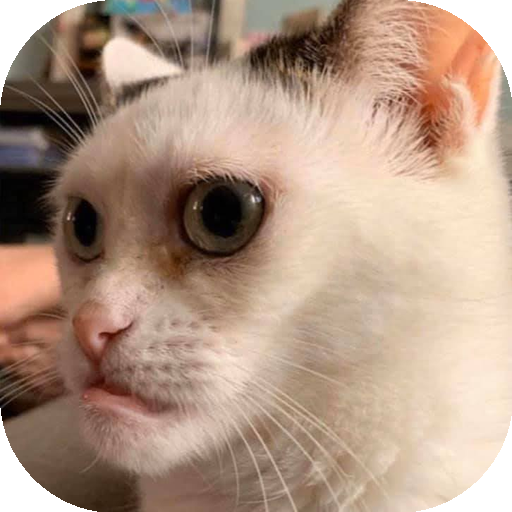
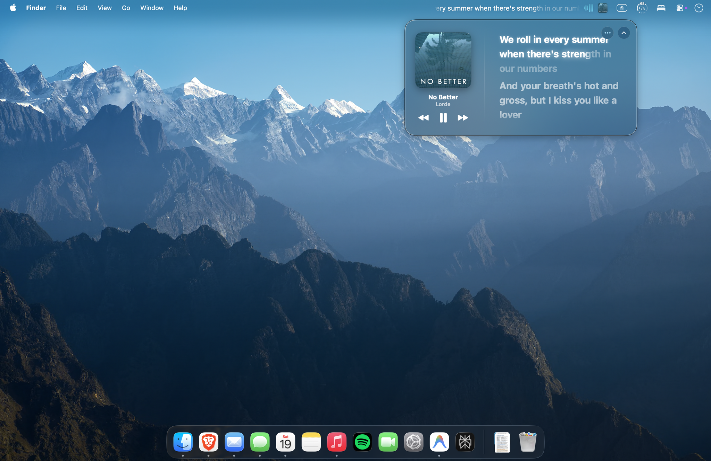
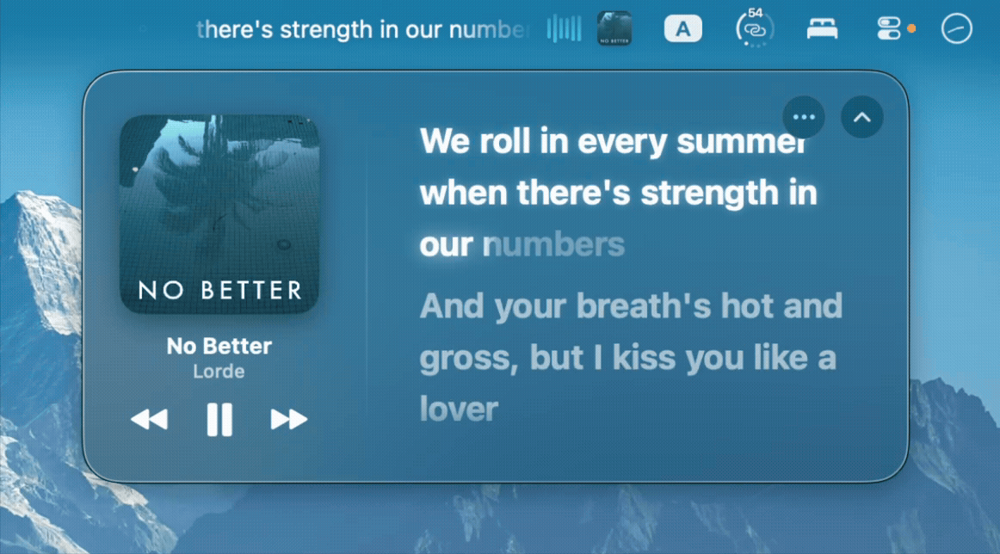

# Lyrics Menu Bar

<p align="center">
  
</p>

<p align="center">
  Synchronized lyrics, audio visualizer, and Force Touch trackpad haptics for macOS.
</p>

<p align="center">
  
  
  
  
  
</p>

<p align="center">
  
</p>

---

## Table of Contents
- [Features](#features)
- [How It Works](#how-it-works)
- [Requirements](#requirements)
- [Installation](#installation)
- [Building from Source](#building-from-source)
- [Repository Structure](#repository-structure)
- [License](#license)

---

## Features

### Real-Time Menu Bar Lyrics
- Synchronized lyrics displayed directly in the macOS menu bar for Spotify and Apple Music.
- Supports syllable-level timing when available, with fallback for line-synced lyrics.
- Shows interlude indicator (`✦ ✦ ✦`) during instrumental sections so you know when the next line starts.
- Automatic marquee scrolling for longer lines.

<p align="center">
  
</p>

### Dynamic Audio Visualizer
- Real-time frequency spectrum visualizer rendered in the menu bar.
- Configurable bar count (8, 14, 20, or up to 128 bars).
- Ballistic filtering with quick rise and smooth fall.
- Flexible display modes: lyrics only, waveform only, or lyrics + waveform + album art.

<p align="center">
  
</p>

### Floating Glass HUD
- Click the menu bar item to toggle the floating glass HUD panel.
- Full lyrics view with auto-scroll following the active line.
- Playback controls: Previous, Play/Pause, Next.
- Click-to-seek: click on any line to jump directly to that timestamp in Spotify or Apple Music.
- Word glow effect with smooth decay as each word is sung.

<p align="center">
  
</p>

### Force Touch Trackpad Haptics
- Uses the MacBook Force Touch trackpad as a tactile bass companion.
- Analyzes low-frequency transients and fires physical haptic clicks on the beat.
- Calibrated 5ms lead time so the tactile pulse matches the acoustic output.
- Multiple intensity presets (Off, Subtle, Medium, Strong) and selectable actuator types.

### In-App Updates & Remote Config
- Automatic update checks against GitHub releases with 1-click in-app download and restart.
- Dynamic Git-hosted remote configuration (`remote_config.json`) for zero-downtime lyrics endpoint updates and announcements.

---

## How It Works

### 1. Audio Capture via CoreAudio Process Tap
- Uses macOS 14.2+ CoreAudio HAL process tap APIs (`AudioObjectCreateProcessTap`).
- Captures raw 32-bit floating-point audio directly from the Spotify or Apple Music process.
- Runs without any virtual audio loopback drivers (no Soundflower, BlackHole, or kernel extensions required).

### 2. Force Touch Actuator Driver (`MultitouchSupport.framework`)
- Talks to the trackpad actuator via Apple's private `MultitouchSupport.framework` functions (`MTActuatorCreateFromDeviceID`, `MTActuatorOpen`, `MTActuatorActuate`).
- Matches the trackpad device using `IOKit` (`AppleMultitouchDevice`).
- Compensates for actuator mechanical rise time:
  $$T_{\text{haptic}} = T_{\text{dac}} - 5\,\text{ms}$$
  The haptic pulse is dispatched 5ms before the audio buffer exits the DAC so the physical click lands at the exact moment sound reaches your ears.

### 3. IPC Playback Clock Interpolation
- Apple Music and Spotify report playback position over ScriptingBridge at approximately 1-second intervals.
- The app computes smooth continuous time between polls using monotonic system time:
  $$t_{\text{current}} = t_{\text{polled}} + (t_{\text{now}} - t_{\text{poll}})$$
- Enforced with monotonic forward clamping to eliminate backward jitter during 60 FPS redraws:
  $$t_{\text{clamped}} = \max(t_{\text{rendered}}, t_{\text{current}})$$

### 4. Audio Spectrum Analysis (vDSP FFT)
- In-place split complex FFT via Apple Accelerate (`vDSP_fft_zrip`) with a 1024-point Hann window.
- Frequency range partitioned logarithmically from 60 Hz to 16,000 Hz.
- Fletcher-Munson perceptual weighting applied across bands.
- Asymmetric ballistic smoothing:
  $$\text{Gain}_{\text{rise}} = 0.4 \cdot \text{Gain} + 0.6 \cdot \text{Sample}$$
  $$\text{Gain}_{\text{fall}} = 0.96 \cdot \text{Gain} + 0.04 \cdot \text{Sample}$$

### 5. Word Glow Decay Model
- Words smoothly decay after vocalization over $\tau = 0.32\,\text{s}$ using a half-cosine curve:
  $$\text{decayFactor}(t) = \frac{1 + \cos\left(\min\left(1, \frac{t - t_{\text{end}}}{\tau}\right) \cdot \pi\right)}{2}$$
  $$\text{GlowOpacity}(t) = 0.35 + 0.40 \cdot \text{decayFactor}(t)$$
  $$\text{GlowRadius}(t) = 2.8 + 2.7 \cdot \text{decayFactor}(t)$$

### 6. Album Art Palette Extraction
- Downsamples album artwork to a 48x48 pixel buffer in `deviceRGB`.
- Filters out extreme shadows ($B < 0.12$) and washed-out highlights ($S < 0.15 \land B > 0.88$).
- Bins colors into 12 hue buckets to extract vibrant, high-contrast accent colors for the UI.

---

## Requirements

- macOS 14.2 (Sonoma) or later
- Apple Silicon or Intel Mac
- Spotify or Apple Music desktop app
- MacBook with Force Touch trackpad (for haptic feedback feature)

---

## Installation

### Pre-built DMG
1. Download `LyricsMenuBar-1.2.0.dmg` from [Releases](https://github.com/tum212/Lyrics-Menu-Bar/releases).
2. Drag **Lyrics Menu Bar** into your `/Applications` folder.
3. Grant **Automation** permissions when prompted on first run.

> [!TIP]
> **If macOS blocks the app on first launch (Gatekeeper):**  
> Right-click the app in `/Applications` and select **Open**, or run:
> ```bash
> xattr -cr "/Applications/Lyrics Menu Bar.app"
> ```

---

## Building from Source

```bash
# Clone the repository
git clone https://github.com/tum212/Lyrics-Menu-Bar.git
cd Lyrics-Menu-Bar

# Build release binary via Swift Package Manager
swift build -c release

# Or package into a DMG
bash build_dmg.sh
```

---

## Repository Structure

```
LyricsMenuBar/
├── Package.swift                    # Swift Package Manager manifest (macOS 14.2+)
├── build_dmg.sh                     # DMG packaging script (Universal arm64 + x86_64)
├── LyricsMenuBar.entitlements       # Hardened runtime & CoreAudio entitlements
├── remote_config.json               # Remote configuration & version database
├── icon.icns                        # Application icon
├── docs/images/                     # Screenshots and demo GIFs
├── Sources/
│   └── LyricsMenuBar/
│       ├── LyricsMenuBarApp.swift   # App entry point, menu bar status item & marquee
│       ├── ContentView.swift        # Glass HUD window, lyrics view & controls
│       ├── HUDGlassView.swift       # Translucent window background view
│       ├── LyricsService.swift      # Lyrics fetching, caching & syllable parsing
│       ├── MusicService.swift       # Apple Music & Spotify IPC bridge
│       ├── AudioAnalyzer.swift      # CoreAudio process tap & vDSP FFT analysis
│       ├── HapticManager.swift      # Force Touch trackpad driver via MultitouchSupport
│       ├── RemoteConfigManager.swift # Git-hosted dynamic config & endpoint provider
│       ├── UpdateManager.swift      # In-app version checker & 1-click DMG installer
│       ├── ColorExtractor.swift     # Album art color palette extraction
│       ├── LaunchAtLoginManager.swift # Login item manager using SMAppService
│       └── SpotifyService.swift     # Legacy bridge
└── README.md                        # Documentation
```

---

## License

This project is licensed under the MIT License. See [LICENSE](LICENSE) for details.
